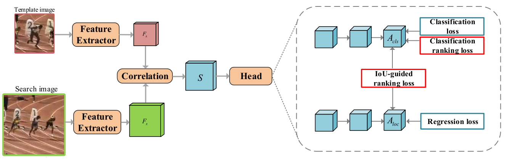

# CSWinTT

The official implementation of the CVPR 2022 paper [**Ranking-Based Siamese Visual Tracking**](https://arxiv.org/abs/2205.11761)



## Highlights
### Introduction
this paper proposes a ranking-based optimization algorithm to explore the relationship among different proposals for Siamese trackers.

## Abstract
 

## Tracking Results and Pretrained Model

**Tracking results:** the raw results of SiamRPN++-RBO/SiamBAN-RBO/SiamPW-RBO/TransT-RBO can be found [here]().


## Environment 

#### Clone the GIT repository.  
```bash
git clone https://github.com/sansanfree/RBO.git
```

## Evalution on the SiamRPN++-RBO

Please refer to the [README](https://github.com/sansanfree/RBO/SiamRPN++-RBO/README.md) 

## Evalution on the SiamPW-RBO

Please refer to the [README]()

## Evalution on the SiamBAN-RBO
coming soon

## Citation
If you find this work useful for your research, please consider citing our work:
```
@inproceedings{Tang_2022_Ranking,
    title={Ranking-Based Siamese Visual Tracking},
    author={Feng, Tang and Qiang Ling},
    booktitle={The IEEE/CVF Conference on Computer Vision and Pattern Recognition (CVPR)},
    year={2022}
}
```


## Contact
If you have any questions, please feel free to contact tang0420@mail.ustc.edu.cn

## Acknowledgments
* Thanks for the SiamRPN++(https://github.com/STVIR/pysot) and SiamBAN(https://github.com/hqucv/siamban) Libraries, which helps us to quickly implement our ideas.
* Thanks for the SiamRPN++(https://github.com/STVIR/pysot) and SiamBAN(https://github.com/hqucv/siamban) Libraries, which helps us to quickly implement our ideas.